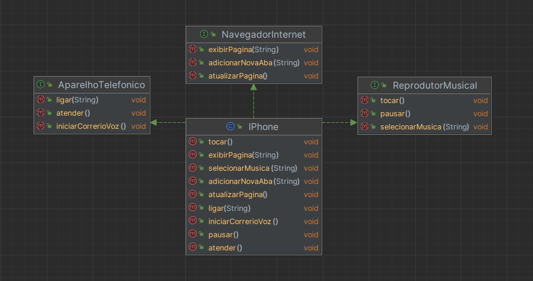

[](exercicio.md)
[](../../exercises/iphone-oop-exercise/exercise.md)

# Solução em UML e Código para o iPhone

Neste projeto, projetamos uma representação para um iPhone focando em três componentes principais:
1. Reprodutor de Música
2. Aparelho Telefônico
3. Navegador de Internet

## Design UML



### Classes & Interfaces:
1. ***Classe***:[`IPhone`](#iphonejava)
2. ***Interface***: [`AparelhoTelefonico`](#aparelhotelefonicojava)
3. ***Interface***: [`NavegadorInternet`](#navegadorinternetjava)
4. ***Interface***: [`ReprodutorMusical`](#reprodutormusicaljava)

### Relacionamentos:
- A classe `IPhone` implementa as interfaces `ReprodutorMusical`, `AparelhoTelefonico` e `NavegadorInternet`.

## Implementação em Código Java

Aqui está uma representação básica das classes e interfaces:
####
### [AparelhoTelefonico.java](./src/java/interfaces/AparelhoTelefonico.java)
```java
public interface AparelhoTelefonico {
void ligar(String numero);
void atender();
void iniciarCorrerioVoz();
}
```
####
### [NavegadorInternet.java](./src/java/interfaces/NavegadorInternet.java)
```java
public interface NavegadorInternet {
void exibirPagina(String url);
void adicionarNovaAba(String url);
void atualizarPagina();
}
```
####
### [ReprodutorMusical.java](./src/java/interfaces/ReprodutorMusical.java)
```java
public interface ReprodutorMusical {
void tocar();
void pausar();
void selecionarMusica(String musica);
}
```
####
### [IPhone.java](./src/java/model/IPhone.java)
```java
public class IPhone implements AparelhoTelefonico, NavegadorInternet , ReprodutorMusical {

    // Implementações da interface AparelhoTelefonico
    public void ligar(String numero) {
        // Código para realizar ligação
    }

    public void atender() {
        // Código para atender chamada
    }

    public void iniciarCorrerioVoz() {
        // Código para iniciar correio de voz
    }

    // Implementações da interface NavegadorInternet
    public void exibirPagina(String url) {
        // Código para exibir página
    }

    public void adicionarNovaAba(String url) {
        // Código para adicionar nova aba
    }

    public void atualizarPagina() {
        // Código para atualizar página
    }

    // Implementações da interface ReprodutorMusical
    public void tocar() {
        // Código para tocar música
    }

    public void pausar() {
        // Código para pausar música
    }

    public void selecionarMusica(String musica) {
        // Código para selecionar música
    }
}
```

## Conclusão

Esta solução oferece uma representação simplificada da funcionalidade de um iPhone em termos de reproduzir música, fazer chamadas telefônicas e navegar na internet. Extensões e melhorias adicionais podem ser feitas para tornar a representação mais realista.