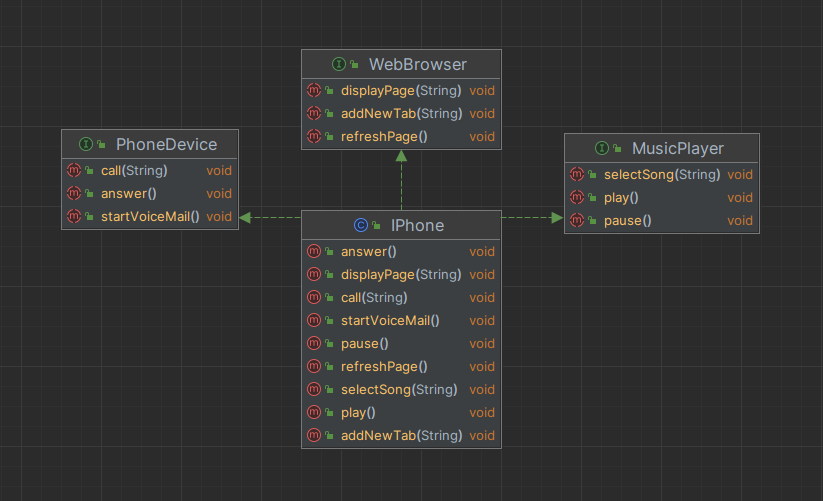

[](../../exercicios/exercicio-oop-iphone/exercicio.md)
[](exercise.md)

# IPhone UML and Code Solution

In this project, we designed a representation for an iPhone focusing on three main components:
1. Music Player
2. Phone Device
3. Web Browser

## UML Design



### Classes & Interfaces:
1. ***Class***: [`IPhone`](#iphonejava)
2. ***Interface***: [`MusicPlayer`](#musicplayerjava)
3. ***Interface***: [`PhoneDevice`](#phonedevicejava)
4. ***Interface***: [`WebBrowser`](#webbrowserjava)

### Relationships:
- The `iPhone` class implements the `MusicPlayer`, `PhoneDevice`, and `WebBrowser` interfaces.

## Java Code Implementation

Here's a basic representation of the classes and interfaces:
####
### [PhoneDevice.java](./src/java/interfaces/PhoneDevice.java)
```java
public interface PhoneDevice {
    void call(String number);
    void answer();
    void startVoiceMail();
}
```
####
### [MusicPlayer.java](./src/java/interfaces/MusicPlayer.java)
```java
public interface MusicPlayer {
    void play();
    void pause();
    void selectSong(String song);
}
```
####
### [WebBrowser.java](./src/java/interfaces/WebBrowser.java)
```java
public interface WebBrowser {
    void displayPage(String url);
    void addNewTab(String url);
    void refreshPage();
}
```
####
### [IPhone.java](./src/java/model/IPhone.java)
```java
public class IPhone implements MusicPlayer, PhoneDevice, WebBrowser {

    // Implementations for MusicPlayer interface
    public void play() {
        // Code to play music
    }

    public void pause() {
        // Code to pause music
    }

    public void selectSong(String song) {
        // Code to select song
    }

    // Implementations for PhoneDevice interface
    public void call(String number) {
        // Code to make a call
    }

    public void answer() {
        // Code to answer a call
    }

    public void startVoiceMail() {
        // Code to start voice mail
    }

    // Implementations for WebBrowser interface
    public void displayPage(String url) {
        // Code to display a page
    }

    public void addNewTab(String url) {
        // Code to add a new tab
    }

    public void refreshPage() {
        // Code to refresh page
    }
}
```

## Conclusion

This solution offers a simplified representation of an iPhone's functionality in terms of playing music, making phone calls, and browsing the internet. Further extensions and improvements can be made to make the representation more realistic.